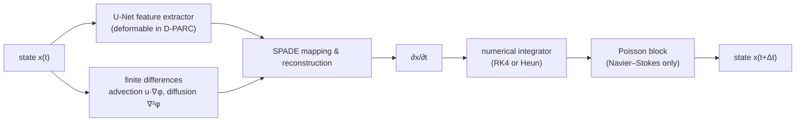

# D-PARC

**Deformable-convolution PARCv2 for spatiotemporal physics.**

D-PARC extends [PARCv2](https://proceedings.mlr.press/v235/nguyen24c.html) (Physics-Aware Recurrent Convolutional Neural Networks, ICML 2024) by replacing the standard convolutions in its U-Net feature extractor with **deformable convolutions**. Every 3×3 kernel learns a per-pixel sampling offset, so the extractor's receptive field can bend toward sharp, moving structures (shock and reaction fronts, velocity gradients, vortices) instead of sampling a fixed square neighborhood. Everything else in the PARCv2 pipeline (finite-difference advection/diffusion, SPADE-based mapping, numerical time integration, optional Poisson pressure block) is unchanged.

The model is evaluated on three 2D benchmarks (reactive energetic materials (HMX), Burgers' equation, and Navier–Stokes) against two baselines: PARCv2 with the same U-Net and standard convolutions, and a "Large" PARCv2 with two extra U-Net levels.

---

## Model

### PARCv2 backbone

The state at each time step is a normalized field of shape `(C, H, W)`: `C − 2` state variables followed by the two velocity components `(u, v)` as the last two channels. One recurrent step works like this:



The **differentiator** (`differentiator/differentiator.py`, `ADRDifferentiator`) predicts the time derivative. The U-Net turns the full current state into dynamic features. For each channel listed in the dataset's advection/diffusion indices, explicit physics terms are computed with a forward-difference stencil (`FiniteDifference`, filter `[-1, 1]`, replicate padding): advection `u ∂φ/∂x + v ∂φ/∂y` and diffusion `∇²φ` (the stencil applied twice). A `MappingAndRecon` block (SPADE → ResNet → 1×1 conv) uses those explicit terms to modulate the dynamic features and outputs `∂φ/∂t`. The two velocity channels are handled jointly. Channels with no advection or diffusion get a zero time derivative, so parameter fields such as the Reynolds-number channel stay constant during the rollout.

The **integrator** (`integrator/integrator.py`) clamps the state to `[0, 1]` before each step, advances it with a fixed-step RK4 or Heun scheme, and, for Navier–Stokes, overwrites the pressure channel with a learned `PoissonBlock`. That block builds `u_x²`, `v_y²` and `u_y·v_x` from the velocity field, concatenates them with its inputs `(Re, u, v)`, and passes the result through a conv/ResNet stack. Data-driven integrators are supported by the code but are disabled (`None`) in every configuration here.

### Deformable feature extractor (the D-PARC change)

`utilities/unet_deform.py` implements the U-Net with a `use_deform` switch. When it is on, every `DoubleConv` block (the initial block and every down/up block) uses:

1. an offset branch: a standard 3×3 `Conv2d` that predicts `2 × 3 × 3 = 18` offset channels per pixel;
2. a 3×3 `torchvision.ops.DeformConv2d` that samples the input at those learned fractional positions (bilinear interpolation);
3. a standard 1×1 `Conv2d`, with LeakyReLU(0.2) after each conv.

The rest of the U-Net is the same in both cases: max-pool downsampling, bilinear upsampling, selective skip concatenation (`up_block_use_concat`, `skip_connection_indices`), and two final 1×1 convs.

### Model variants

The three variants per dataset are defined in `PARCtorch/scripts/dataset_model_configs.py` (`MODEL_CONFIGS`). The notebooks refer to them as **D-PARC**, **PARC-v2** and **PARC-v2-L**.

| Name in notebooks | Config key | Deformable | U-Net block dimensions |
|---|---|---|---|
| D-PARC | `small_deform` | yes | HMX/NS: `[64, 128, 256, 512, 1024]` · Burgers: `[64, 128, 256]` |
| PARC-v2 | `small_no_deform` | no | same as D-PARC |
| PARC-v2-L | `large_no_deform` | no | HMX/NS: `[64 … 4096]` (7 levels) · Burgers: `[64 … 1024]` (5 levels) |

Parameter counts, computed by building each configuration from the code in this repo:

| Variant | HMX | Burgers | Navier–Stokes |
|---|---|---|---|
| D-PARC | 19,745,873 | 1,261,826 | 16,863,661 |
| PARC-v2 | 19,229,509 | 1,158,210 | 16,347,459 |
| PARC-v2-L | 243,569,477 | 15,187,522 | 240,687,427 |

The deformable branch adds 2.7% (HMX), 8.9% (Burgers) and 3.2% (NS) parameters over PARC-v2, while the large baseline is roughly 13 to 15 times bigger.

### Benchmarks

Per-dataset physics settings live in `DATASET_CONFIGS` in the same file.

| Key | Dataset | Channels (in order) | Integrator | Advection | Diffusion | Poisson | Training rollout | Grid (H×W) |
|---|---|---|---|---|---|---|---|---|
| `hmx` | Reactive energetic materials (HMX) | T, P, microstructure μ, u, v | RK4 | all 5 | T | — | 2 steps | 128×256 |
| `burgers` | 2D viscous Burgers | Re, u, v | Heun | u, v | u, v | — | 3 steps | 64×64 |
| `ns` | 2D Navier–Stokes | Re, P, u, v | Heun | u, v | u, v | (Re, u, v) → P | 3 steps | 128×256 |

The training loss is L1 over the predicted rollout. It excludes the Reynolds-number channel for Burgers and NS (`loss_start_channel = 1`) and uses all channels for HMX. Training uses Adam with a learning rate of `1e-5`.

---

## Repository layout

```
D-PARC/
└── PARCtorch/
    ├── PARCv2.py                    # top-level model: differentiator + integrator
    ├── train.py                     # minimal single-GPU training loop (train_model)
    ├── differentiator/              # ADRDifferentiator, advection, diffusion, finite differences, SPADE mapping
    ├── integrator/                  # Euler / Heun / RK4, Poisson block, data-driven integrator, torchdiffeq wrapper
    ├── utilities/
    │   ├── unet_deform.py           # U-Net feature extractor with optional deformable convs (D-PARC)
    │   ├── spade.py, resnet.py      # building blocks
    │   ├── metrics.py               # strain rate, vorticity, deformable-kernel offset metrics
    │   ├── viz.py                   # plotting and GIF helpers
    │   └── load.py                  # checkpoint loading
    ├── data/
    │   ├── dataset.py               # GenericPhysicsDataset + custom_collate_fn (training / evaluation)
    │   ├── dataset_opt.py           # variant with a pre_normalized option that also returns file names
    │   ├── includedt.py             # shock-tube dataset (appends per-case metadata channels)
    │   ├── normalization.py         # compute_min_max: per-channel min/max → JSON
    │   └── *_min_max.json           # normalization stats: hmx, b (Burgers), ns, shocktube
    ├── results/                     # saved effective-receptive-field (ERF) maps, deform vs. no-deform
    └── scripts/
        ├── train_ns.py              # unified training script for all three datasets
        ├── dataset_model_configs.py # DATASET_CONFIGS and MODEL_CONFIGS
        ├── train_<dataset>_<variant>.sh   # 9 SLURM templates (3 datasets × 3 variants)
        ├── burgers_slurm.py, em_slurm_seq.py, burgers.sh, scratch_deform.sh   # earlier single-dataset trainers
        ├── dparc_model_demonstration.ipynb    # unified demo: all three models on any dataset
        ├── Burgers_results.ipynb, EM_results.ipynb, NS_results.ipynb   # per-dataset evaluation
        ├── burgers_scripts/, hmx_scripts/, ns_scripts/   # per-pixel deformable-offset analysis + SLURM drivers
        ├── paper_figure.py, paper_fig.sh   # GT-vs-prediction figures for a PARCv2 shock-tube model
        └── PARCtorch-0.2.2-py3-none-any.whl   # snapshot of upstream PARCtorch 0.2.2
```

---

## Installation

```bash
git clone https://github.com/JackBeerman/D-PARC.git
cd D-PARC

conda create -n dparc python=3.11 -y
conda activate dparc

# PyTorch + torchvision built for your CUDA version (torchvision provides DeformConv2d)
pip install torch torchvision
pip install numpy matplotlib tqdm pandas scipy scikit-learn scikit-image imageio jupyter

```

There is no `setup.py`. Code uses the package in one of two ways:

- **Notebooks and the quick start below** put the repo root on `sys.path`, so `import PARCtorch` resolves to the local package (`ADRDifferentiator`, `utilities.unet_deform`, and so on).
- **Scripts in `PARCtorch/scripts/`** are meant to be run from that directory. They add `PARCtorch/` to `sys.path` to import `data`, `utilities` and `dataset_model_configs`, and they import the core model modules (`PARCtorch.PARCv2`, `PARCtorch.differentiator.*`, `PARCtorch.integrator.*`) from the active Python environment.

---

## Data format

Each simulation is one `.npy` file with shape `(timesteps, channels, H, W)`, using the channel order from the benchmark table (velocities last). Put the files for a split in a directory; any number of directories can be passed.

Normalization is per-channel min–max to `[0, 1]`:

```python
from PARCtorch.data.normalization import compute_min_max
compute_min_max(["/path/to/train"], "PARCtorch/data/my_min_max.json")
# writes {"channel_min": [...], "channel_max": [...]}
```

`GenericPhysicsDataset(data_dirs, future_steps, min_max_path)` slides a window over every file. Each sample is an initial condition plus the next `future_steps` frames, with `t0 = 0` and `t1 = [1, …, K] / (T + 1)`, where `T` is the number of timesteps in a file. With `custom_collate_fn`, a batch is:

| Tensor | Shape |
|---|---|
| `ic` | `(B, C, H, W)` |
| `t0` | scalar |
| `t1` | `(K,)` |
| `target` | `(K, B, C, H, W)`, the same layout as the model output |

---


## Training

`PARCtorch/scripts/train_ns.py` is the main training entry point. Despite its name, it trains any dataset and variant through `--dataset` and `--model_config`. Run it from `PARCtorch/scripts/`:

```bash
cd PARCtorch/scripts
python train_ns.py \
    --dataset burgers \
    --model_config small_deform \
    --train_dirs /path/to/Burgers/train \
    --val_dirs   /path/to/Burgers/val \
    --batch_size 4 \
    --num_epochs 500 \
    --save_frequency 25 \
    --save_dir ../../runs/burgers/small_deform/weights \
    --loss_dir ../../runs/burgers/small_deform/loss \
    --device cuda
```

| Argument | Default | Description |
|---|---|---|
| `--dataset` | *(required)* | `hmx`, `burgers` or `ns` |
| `--model_config` | `large_no_deform` | `small_deform` (D-PARC), `small_no_deform` (PARC-v2) or `large_no_deform` (PARC-v2-L); `--model` is an alias |
| `--train_dirs`, `--val_dirs` | *(required)* | one or more directories of `.npy` files |
| `--batch_size` | 8 | |
| `--num_epochs` | 50 | when resuming, the number of *additional* epochs |
| `--save_frequency` | 100 | save `checkpoint_epoch_N.pth` every N epochs |
| `--save_dir` / `--loss_dir` | `../weights` / `../loss` | checkpoint and log/loss output directories |
| `--min_max_output` | dataset's JSON in `../data/` | where to write the normalization stats |
| `--load_mod` | none | checkpoint to initialize from (raw `state_dict` or `best_model.pth` dict) |
| `--resume_training`, `--start_epoch` | off, 1 | continue epoch numbering and loss history from `--start_epoch` |
| `--future_steps` | 1 | recorded with the run's loss history; the training window itself comes from `DATASET_CONFIGS` |
| `--visualize` | off | plot one batch before training |
| `--log_file`, `--device` | `training.log`, `cuda` | |

**Normalization.** At startup the script recomputes min/max from `--train_dirs` and writes them to `--min_max_output`. By default that is the dataset's JSON in `PARCtorch/data/`, so the committed file is overwritten with your training statistics. Use the same JSON at evaluation time.

**Outputs.**

| Location | Files |
|---|---|
| `--save_dir` | `best_model.pth` (dict with `model_state_dict`, `optimizer_state_dict`, `epoch`, `val_loss`, `dataset`, `model_name`, `future_steps`), `checkpoint_epoch_N.pth` and `latest_checkpoint.pth` (raw `state_dict`s) |
| `--loss_dir` | timestamped log, `loss_history.pkl`, `training_metrics.png`, `training_summary_report.txt` |

`PARCtorch/train.py` also provides a minimal loop, `train_model(model, loader, criterion, optimizer, num_epochs, save_dir, app)` with `app` set to `"burgers"`, `"ns"` or `"em"`. It saves `model.pth` every epoch and `training_losses.pkl` at the end.

### SLURM templates (UVA Rivanna)

`PARCtorch/scripts/train_<dataset>_<variant>.sh` are the job scripts used for the three datasets × three variants. They request one A100 80 GB (HMX, NS) or one A40 (Burgers), load `miniforge` and `cuda/11.8.0`, activate a conda env named `dparc`, and call `train_ns.py`. Before submitting on another system, edit:

- the `#SBATCH -A` account, partition and GPU lines;
- `PYTHON_PATH` and `PYTHONPATH`;
- `TRAIN_DIRS`, `VAL_DIRS`, `SAVE_DIR` and `LOSS_DIR`.

Most templates are currently set to **resume** a run through `--load_mod`, `--start_epoch` and `--resume_training`. Remove those three lines to train from scratch. Submit from `PARCtorch/scripts/`, which is where the `logs/` directory is created:

```bash
cd PARCtorch/scripts
sbatch train_burgers_small_deform.sh
```

`burgers_slurm.py` / `burgers.sh` and `em_slurm_seq.py` / `scratch_deform.sh` are earlier single-dataset trainers. Their architecture is hard-coded in `build_model()`, and deformable convolutions are toggled with the `use_deform` flag there.

---

## Evaluation and analysis

| What | Where |
|---|---|
| Side-by-side D-PARC / PARC-v2 / PARC-v2-L predictions, parameter counts, multi-point ERF analysis and figures for any dataset | `scripts/dparc_model_demonstration.ipynb`: set `SELECTED_DATASET` and the checkpoint / data paths in `DATASET_CONFIGS` |
| Per-dataset rollout error (RMSE, SSIM), inference timing and ERF analysis; the HMX notebook adds hotspot metrics | `scripts/Burgers_results.ipynb`, `scripts/NS_results.ipynb`, `scripts/EM_results.ipynb` |
| Per-pixel analysis linking learned deformable-kernel offsets (anisotropy, ellipse area, deformation magnitude) to local physics (strain rate, etc.), written to one CSV | `scripts/{burgers,hmx,ns}_scripts/per_pixel_analysis.py` with the `analysis.sh` SLURM drivers; `--layer_name` picks the U-Net layer whose offsets are read |
| Clustering and figures/GIFs from the per-pixel CSV (kernel offsets overlaid on the field) | `scripts/hmx_scripts/individual.ipynb` and the "Individual" section of the demo notebook |
| Saved ERF maps (deform vs. no-deform) with their configs | `PARCtorch/results/` |
| Ground-truth vs. prediction figures for a PARCv2 shock-tube model | `scripts/paper_figure.py`, `scripts/paper_fig.sh` |

Trained checkpoints are not stored in the repository (`*.pth` is git-ignored). Point the notebooks and scripts at your own weights.

--

## Citation

D-PARC builds on PARCv2 and [PARCtorch](https://github.com/baeklab/PARCtorch). If you use this code, please cite:

<!-- TODO: add the D-PARC citation here -->

```bibtex
@InProceedings{pmlr-v235-nguyen24c,
  title     = {{PARC}v2: Physics-aware Recurrent Convolutional Neural Networks for Spatiotemporal Dynamics Modeling},
  author    = {Nguyen, Phong C.H. and Cheng, Xinlun and Azarfar, Shahab and Seshadri, Pradeep and Nguyen, Yen T. and Kim, Munho and Choi, Sanghun and Udaykumar, H.S. and Baek, Stephen},
  booktitle = {Proceedings of the 41st International Conference on Machine Learning},
  pages     = {37649--37666},
  year      = {2024},
  volume    = {235},
  series    = {Proceedings of Machine Learning Research},
  publisher = {PMLR},
  url       = {https://proceedings.mlr.press/v235/nguyen24c.html}
}
```
